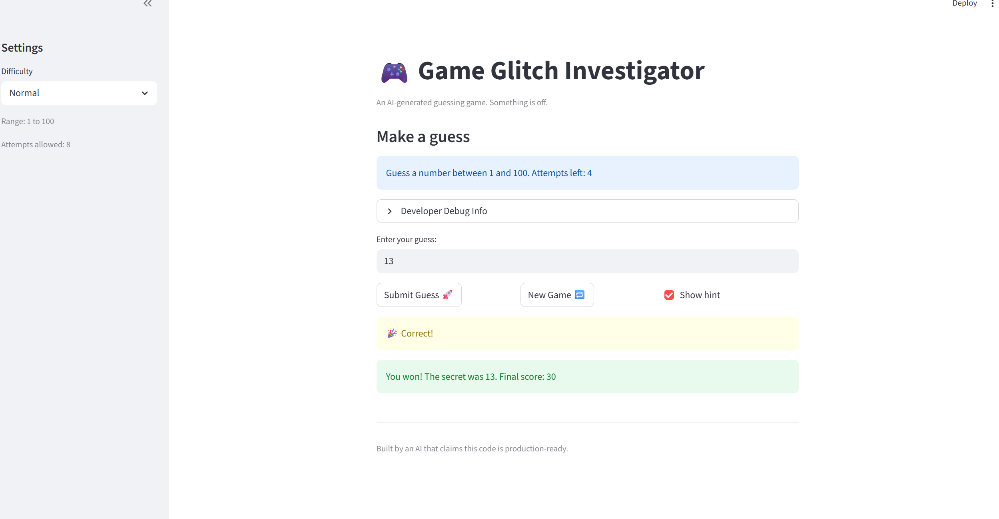
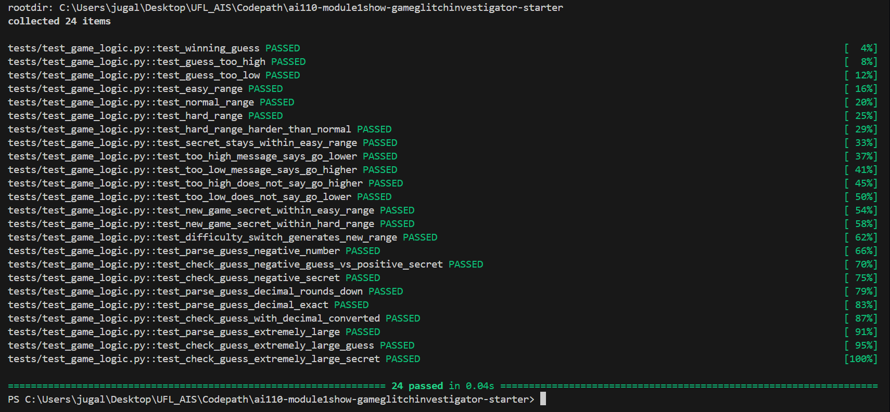
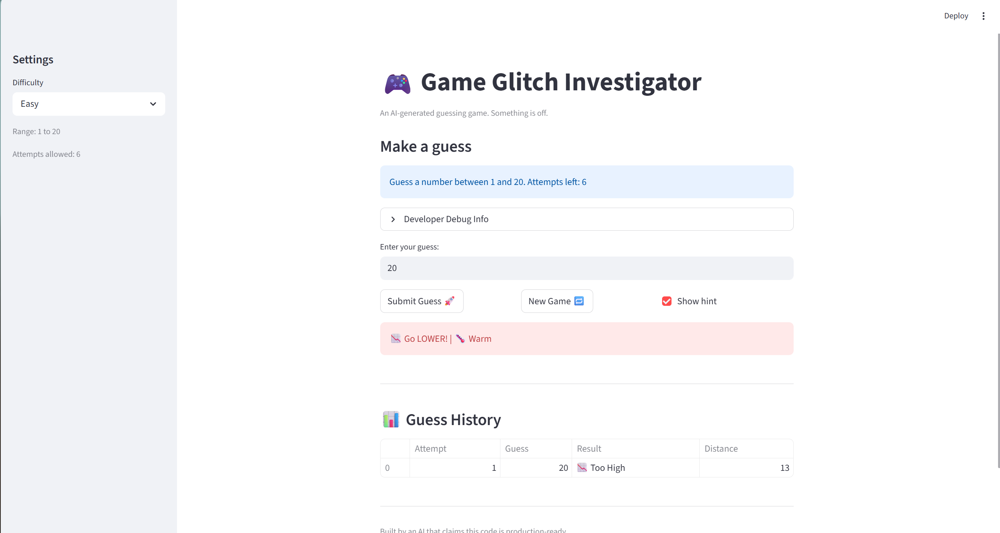
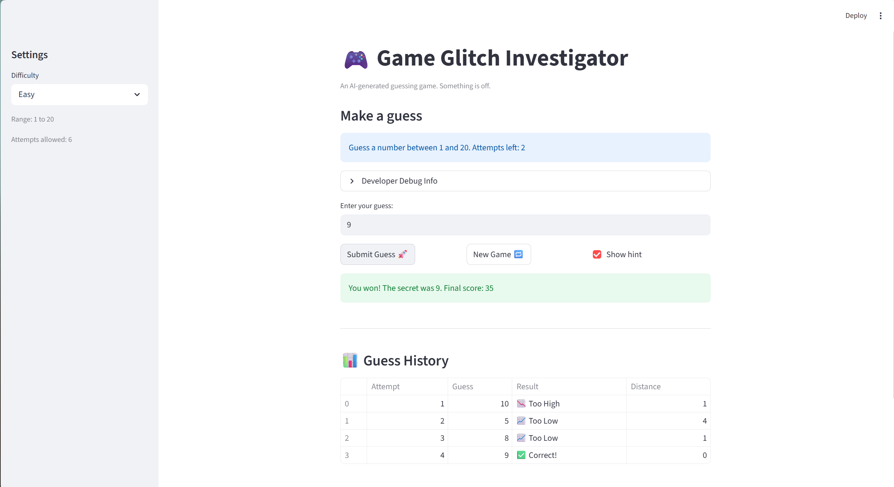

# 🎮 Game Glitch Investigator: The Impossible Guesser

## 🚨 The Situation

You asked an AI to build a simple "Number Guessing Game" using Streamlit.
It wrote the code, ran away, and now the game is unplayable. 

- You can't win.
- The hints lie to you.
- The secret number seems to have commitment issues.

## 🛠️ Setup

1. Install dependencies: `pip install -r requirements.txt`
2. Run the broken app: `python -m streamlit run app.py`

## 🕵️‍♂️ Your Mission

1. **Play the game.** Open the "Developer Debug Info" tab in the app to see the secret number. Try to win.
2. **Find the State Bug.** Why does the secret number change every time you click "Submit"? Ask ChatGPT: *"How do I keep a variable from resetting in Streamlit when I click a button?"*
3. **Fix the Logic.** The hints ("Higher/Lower") are wrong. Fix them.
4. **Refactor & Test.** - Move the logic into `logic_utils.py`.
   - Run `pytest` in your terminal.
   - Keep fixing until all tests pass!

## 📝 Document Your Experience

**Game Purpose:**
A number guessing game where the player picks a difficulty, gets a secret number within that difficulty's range, and tries to guess it within a limited number of attempts. Hints guide the player higher or lower after each guess.

**Bugs Found:**

| S.No. | Bug | Where |
|---|---|---|
| 1 | Wrong difficulty ranges — Hard returned 1–50 (easier than Normal's 1–100); hint text hardcoded "1 and 100"; New Game and difficulty switch both ignored difficulty range | `app.py` / `logic_utils.py` |
| 2 | Hints completely backwards — "Too High" said "Go HIGHER!" and "Too Low" said "Go LOWER!" | `logic_utils.py` |
| 3 | New Game button broken — only reset `attempts` and `secret`, leaving `status`/`score`/`history` unchanged so `st.stop()` fired immediately after rerun | `app.py` |

**Fixes Applied:**

- **Bug 1:** Corrected Hard range to 1–200. Replaced hardcoded hint text with `{low}`/`{high}`. Added `session_state.difficulty` tracking to detect difficulty changes and regenerate the secret within the correct range.
- **Bug 2:** Swapped the return messages in `check_guess` — `guess > secret` now returns "Go LOWER!" and `guess < secret` now returns "Go HIGHER!". Fixed in both the main branch and the `TypeError` string-comparison fallback.
- **Bug 3:** New Game now resets all 5 state variables: `attempts`, `secret`, `status`, `score`, and `history`.
- **Refactor:** Moved `get_range_for_difficulty`, `parse_guess`, `check_guess`, and `update_score` from `app.py` into `logic_utils.py`. `app.py` now imports them.

**AI Collaboration (Claude Agent Mode):**
Used Claude Code (Agent mode) to identify root causes, suggest fixes, and refactor logic into `logic_utils.py`. Each fix was reviewed via diff before accepting. Collaboration comments are documented inline in the code.

## 📸 Demo

**Fixed game — successful win on Normal difficulty (secret was 13):**

> The game correctly shows "Guess a number between 1 and 100", gave accurate hints, and the New Game button resets cleanly without a page refresh.

**Challenge 1 — pytest results (13 tests, all passing):**

> Run `python -m pytest tests/test_game_logic.py -v` and insert your screenshot below.

## 🚀 Stretch Features

### ✅ Challenge 4: Enhanced Game UI

Three UI improvements were added to `app.py` without touching any core game logic:

- **Color-coded hints** — Too High shows as a red `st.error`, Too Low shows as a yellow `st.warning` so the player can instantly tell direction by color alone
- **Hot/Cold proximity emoji** — Each hint includes 🔥 Very Hot (≤5 away), 🌡️ Warm (≤15), 🧊 Cold (≤30), or ❄️ Freezing (>30) based on how close the guess is to the secret
- **Guess History table** — A live summary table below each guess showing every attempt number, the guess value, result (Too High / Too Low / Correct), and distance from the secret

**Color-coded hint + Hot/Cold emoji in action:**

**Guess History table showing all attempts:**

